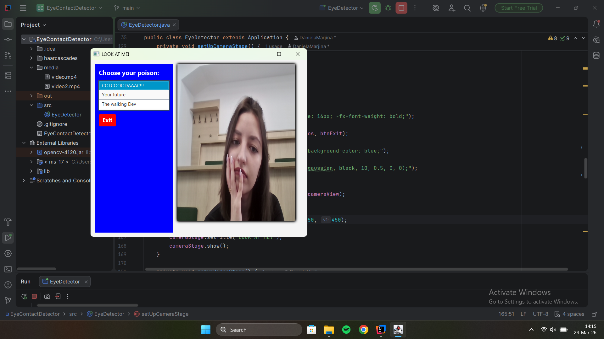
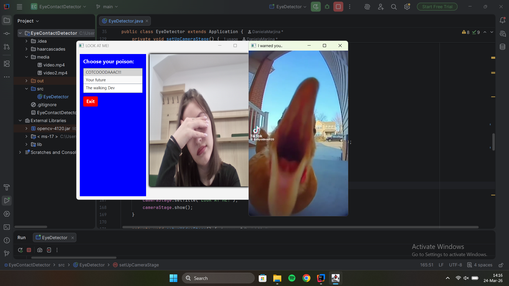
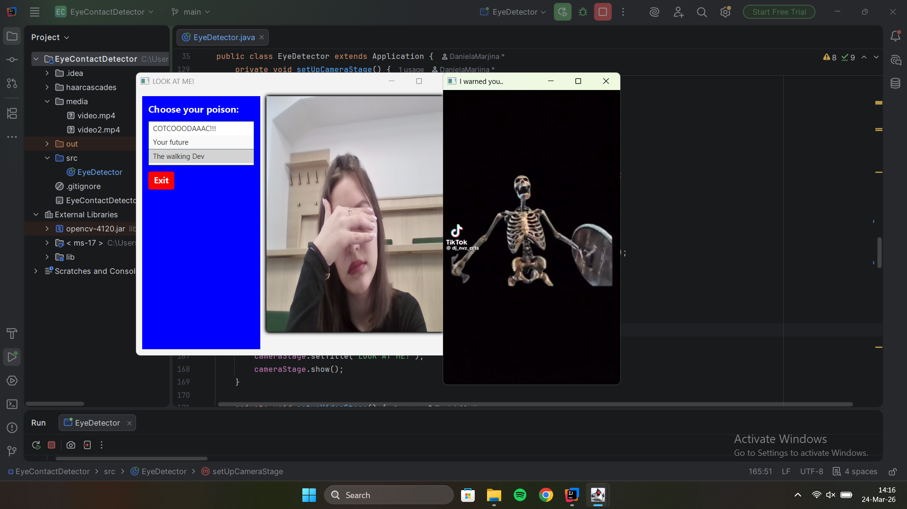
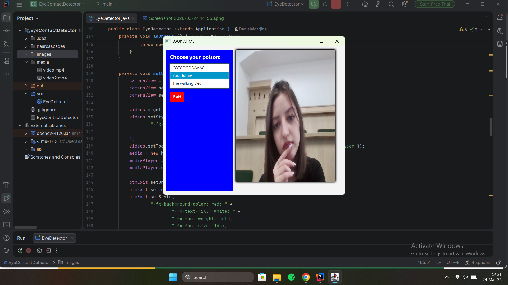

# Eye Contact Detector (JavaFX + OpenCV)

## Overview
This project is a desktop application built with **JavaFX** and **OpenCV** that monitors whether a user is looking at the screen using their webcam.

Depending on the user's attention:
-  A video is played when no eye contact is detected
-  A browser page can be opened as a "warning"
-  The system pauses when the user is paying attention

---

## Features
- Real-time webcam capture using OpenCV
- Face and eye detection with Haar Cascades
- Interactive UI built with JavaFX
- Video playback using MediaPlayer
- Automatic browser launch when attention is lost
- Multithreading for smooth UI performance

---

## Technologies Used
- Java
- JavaFX
- OpenCV
- MediaPlayer API

---

## How It Works
1. The webcam continuously captures frames.
2. Each frame is processed to detect faces and eyes.
3. If eyes are detected → user is attentive → video stops.
4. If not → video plays or browser opens (depending on selection).

---

## Demo

### Camera Detection

